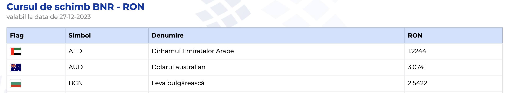

# Curs Valutar BNR
[](#)
[](#)
[](#)
[](#)
[](#)
[](#)
[](#)

## Preluarea zilnica a cursului valutar BNR 🧑‍💻

**Scurta descriere:**

- vom parsa fisierul `XML` oferit de **Banca Nationala a Romaniei**
- se vor incarca intr-o pagina web informatiile privind cursul valutar din `ziua curenta`
- vom afisa in pagina web inclusiv steagurile folosindu-ne de un fisier `JSON` unde a fost creat un dictionar
- pagina web a fost customizata folosind `Bootstrap5` cat si fisierul `styles.css`
- pagina web este pusa in functiune de framework-ul `Flask`


## Screenshots 🎞️




## Pregatirea proiectului ⚙️

### ⚠️ Este necesar ca Python sa fie deja instalat!


- Crearea folderului `curs-valutar` si accesarea acestuia

```bash
    $ mkdir curs-valutar
    $ cd curs-valutar
```

- Crearea unui `environment` si activarea acestuia

```sh
    $ python3 -m venv .venv
    $ . .venv/bin/activate
```

- Instalarea framework-ului `Flask` si libraria `request` 

```sh
    $ pip install Flask
    $ pip install requests
```

## AND ... BOOM : Lansam aplicatia! :rocket:

```sh
$  python3 app.py
```

## Feedback and Support 📩
Va rugam sa ne contactati la adresa 

mircea@softdesk.ro